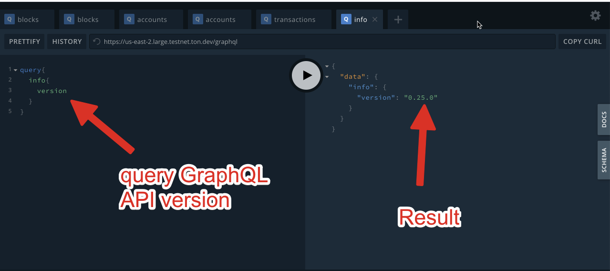

# Samples

Use our GraphQL web playground. Insert the code samples on the left side and see the result on the right side.

* [Quick Start](samples.md#quick-start)
* [General network queries](samples.md#general-network-queries)
  * [Get a network config](samples.md#get-a-network-config)
  * [Query the latest masterchain block height](samples.md#query-the-latest-masterchain-block-height)
  * [Get the current list of shards](samples.md#get-the-current-list-of-shards)
  * [Query the latest shardchain block height](samples.md#query-the-latest-shardchain-block-height)
  * [Get the number of transactions in a specified shard over a period of time.](samples.md#get-the-number-of-transactions-in-a-specified-shard-over-a-period-of-time)
* [Block queries](samples.md#block-queries)
  * [Get the block hash by seq_no](samples.md#get-the-block-hash-by-seq_no)
  * [Get block transactions](samples.md#get-block-transactions)
* [Account queries](samples.md#account-queries)
  * [Get account info](samples.md#get-account-info)
  * [Pagination of account transactions](samples.md#pagination-of-account-transactions)
  * [Get the last message from user's account to a specified destination address](samples.md#get-the-last-message-from-users-account-to-a-specified-destination-address)
  * [Get all transactions of a specified account](samples.md#get-all-transactions-of-a-specified-account)
  * [Get all messages of a specified account](samples.md#get-all-messages-of-a-specified-account)
  * [Get the number of account transactions](samples.md#get-the-number-of-account-transactions)
  * [Aggregate transfers between 2 accounts](samples.md#aggregate-transfers-between-2-accounts)
  * [Aggregate gas consumption](samples.md#aggregate-gas-consumption)
* [Transaction queries](samples.md#transaction-queries)
  * [Query transaction data](samples.md#query-transaction-data)
  * [Get aborted transaction reason](samples.md#get-aborted-transaction-reason)
  * [Get all transaction fees](samples.md#get-all-transaction-fees)

## Quick Start

Go to net.ton.dev/graphql (or [choose another network GraphQL endpoint](networks.md)) in your browser.

You will see the GraphQL playground.

In this picture we query the GraphQL API version on the left and see the result on the right.

```
query{
  info{
    version
  }
}
```



Check out [TON Labs SDK query module](../modules/mod_net.md) - the official TON Labs wrapper over GraphQL API for root queries and subscriptions.

## General network queries

### Get a network config

Fetch the last key block and get config from it:

```
query{
  blocks(filter:{
    workchain_id:{
      eq:-1
    }
    key_block:{
      eq:true
    }

  }
    orderBy:{
      path:"seq_no"
      direction:DESC
    }
    limit: 1
  )
  {
    id
       master { 
          config {
            p15 {
              validators_elected_for
              elections_start_before
              elections_end_before
              stake_held_for
            }
             p16 {
              max_validators
              max_main_validators
              min_validators
            }
            p17 {
              min_stake
              max_stake
              min_total_stake
              max_stake_factor          
            }
            p34 {
              utime_since
              utime_until
              total
              total_weight
              list {
                public_key
                adnl_addr
                weight
              }
            }

          }
      }
  }
}
```

You will get the result:

```
"data": {
    "blocks": [
      {
        "id": "bcddfbde6a6aaf5aec485b10a31d95d0854bae2a8c42d4e1d4aefc5abcc1038b",
        "master": {
          "config": {
            "p15": {
              "validators_elected_for": 65536,
              "elections_start_before": 32768,
              "elections_end_before": 8192,
              "stake_held_for": 32768
            },
            "p16": {
              "max_validators": 1000,
              "max_main_validators": 100,
              "min_validators": 13
            },
            "p17": {
              "min_stake": "0x9184e72a000",
              "max_stake": "0x2386f26fc10000",
              "min_total_stake": "0x5af3107a4000",
              "max_stake_factor": 196608
            },
            "p34": {
              "utime_since": 1602143452,
              "utime_until": 1602208988,
              "total": 50,
              "total_weight": "0xfffffffffffffe9",
              "list": [
                {
                  "public_key": "90ea4fe8575d130bc103b7fbb9f8435f9a3b283e0188078066f96269a63f9841",
                  "adnl_addr": "59a66ce3f95bfcb5337482fff1ca22489ec4a340af9efab9ab713b6e9f5b311d",
                  "weight": "0x81c19e63fe5f51"
                },
                {
                  "public_key": "85eb9c8b781014df3554994c7c04f76850b2a61a05a841ad2087b9357c2e2b71",
                  "adnl_addr": "e0ee212d1d3fa671237ec14c5f428fe3024bf49cc38b29aa2562b8a73c106967",
                  "weight": "0x7df693d5a2fa8c"
                },
                {
                  "public_key": "348d2f4af518e0c027158b381c0f854ea8046c72bbea320df35565d7d636ba6b",
                  "adnl_addr": "4edfacd00dc54a0ca53ddf4040c7488d4eed8fe9abd4859b26e2d07f36e02f1a",
                  "weight": "0x7df693d5a2fa8c"
                },
              ...
```

You can also query other config data:

```
query { 
  blocks(filter: { 
    seq_no: { eq: 3127942 }
    workchain_id: { eq: -1}  
  }) {
    master {
      config_addr
      config {
#Address of config contract in mc
        p0
#Address of elector contract in mc
        p1
#Address of minter contract in mc
        p2
#Address of fee collector contract in mc
        p3
#Address of TON DNS root contract in mc
        p4
#Minter prices
        p6 {
          mint_new_price
          mint_add_price
        }
#Other Currencies
        p7 {
          currency
          value
        }
#Global version
        p8 {
          version
          capabilities
        }
#
        p9
#        
        p10
#Config voting setup
        p11 {
          normal_params {
            min_tot_rounds
            max_tot_rounds
            min_wins
            max_losses
            min_store_sec
            max_store_sec
            bit_price
            cell_price
          }
          critical_params {
            min_tot_rounds
            max_tot_rounds
            min_wins
            max_losses
            min_store_sec
            max_store_sec
            bit_price
            cell_price
          }
        }
#Array of all workchain descriptions
        p12 {
          workchain_id
          enabled_since
          actual_min_split
          min_split
          max_split
          active
          accept_msgs
          flags
          zerostate_root_hash
          zerostate_file_hash
          version
          basic
          vm_version
          vm_mode
          min_addr_len
          max_addr_len
          addr_len_step
          workchain_type_id
        }
#Block create fees
        p14 {
          masterchain_block_fee
          basechain_block_fee
        }
#Election parameters
        p15 {
          validators_elected_for
          elections_start_before
          elections_end_before
          stake_held_for
        }
#Validators count
        p16 {
          max_validators
          max_main_validators
          min_validators
        }
#Validator stake parameters
        p17 {
          min_stake
          max_stake
          min_total_stake
          max_stake_factor
        }
#Storage prices
        p18 {
          utime_since
          bit_price_ps
          cell_price_ps
          mc_bit_price_ps
          mc_cell_price_ps
        }
#Gas limits and prices in the masterchain
        p20 {
          gas_price
          gas_limit
          special_gas_limit
          gas_credit
          block_gas_limit
          freeze_due_limit
          delete_due_limit
          flat_gas_limit
          flat_gas_price
        }
#Gas limits and prices in workchains
        p21 {
          gas_price
          gas_limit
          special_gas_limit
          gas_credit
          block_gas_limit
          freeze_due_limit
          delete_due_limit
          flat_gas_limit
          flat_gas_price 
        }
#Block limits in the masterchain
        p22 {
          bytes {
              underload
              soft_limit
              hard_limit
          }
            gas {
              underload
              soft_limit
              hard_limit
            }
            lt_delta {
              underload
              soft_limit
              hard_limit
            }
          }
#Block limits in workchains
        p23 {
          bytes {
              underload
              soft_limit
              hard_limit
            }
            gas {
              underload
              soft_limit
              hard_limit
            }
            lt_delta {
              underload
              soft_limit
              hard_limit
            } 
        }
#Message forward prices in the masterchain
        p24 {
          lump_price
          bit_price
          cell_price
          ihr_price_factor
          first_frac
          next_frac
        } 
#Message forward prices in workchains
        p25 {
          lump_price
          bit_price
          cell_price
          ihr_price_factor
          first_frac
          next_frac
        }
#BlockMasterCongig
        p28 {
          mc_catchain_lifetime
          shard_catchain_lifetime
          shard_validators_lifetime
          shard_validators_num
        }
#BlockMasterConfig
        p29 {
          round_candidates
          next_candidate_delay_ms
          consensus_timeout_ms
          fast_attempts
          attempt_duration
          catchain_max_deps
          max_block_bytes
          max_collated_bytes
        }
#Addresses of some service contracts
        p31
#Previous validators set
        p32 {
          utime_since
          utime_until
          total
          total_weight
          list {
            public_key
            adnl_addr
            weight
          }
        }
#Previous temporary validators set
        p33 {
          utime_since
          utime_until
          total
          total_weight
          list {
            public_key
            adnl_addr
            weight
          }
        }
#Current validators set
        p34 {
          utime_since
          utime_until
          total
          total_weight
          list {
            public_key
            adnl_addr
            weight
          }
        }
#Current temporaty validators set
        p35 {
          utime_since
          utime_until
          total
          total_weight
          list {
            public_key
            adnl_addr
            weight
          }
        }
#Next validators set
        p36 {
          utime_since
          utime_until
          total
          total_weight
          list {
            public_key
            adnl_addr
            weight
          }
        }
#Next temporary validators set
        p37 {
          utime_since
          utime_until
          total
          total_weight
          list {
            public_key
            adnl_addr
            weight
          }
        }
#Array of validators signed temporaty keys
        p39 {
          adnl_addr
          temp_public_key
          seqno
          valid_until
          signature_r
          signature_s
        }
      } 
    }
  }
}
```

### Query the latest masterchain block height

Masterchain has only 1 shard `8000000000000000`.

So, to get its last block height we sort its blocks by `seq_no` in DESC order and get the newest one

```
query{
  blocks(filter:{
    workchain_id:{
      eq:-1
    }   
  }
    orderBy:{
      path:"seq_no"
      direction:DESC
    }
    limit: 1
  )
  {
    id
    workchain_id
    shard
    seq_no
  }
}
```

The the latest masterchain block height is `1418096`:

```
{
  "data": {
    "blocks": [
      {
        "id": "8d2a104aeaf7ce6dc96859c6476d6977bf83af5cc1198fb78fd5efb48e52a8bf",
        "workchain_id": -1,
        "shard": "8000000000000000",
        "seq_no": 1418096
      }
    ]
  }
}
```

See below how to query the list of shards and get the block height for every shard.

### Get the current list of shards

Workchain shard list can change dynamically depending on the network load.

To get the list of shards for Zero workchain for the current moment run this query. Here we sort the main workchain blocks by `seq_no`, get the newest one and extract the list of active shards of Zero workchain.

```
query{
  blocks(filter:{
    workchain_id:{
      eq:-1
    }   
  }
    orderBy:{
      path:"seq_no"
      direction:DESC
    }
    limit: 1
  )
  {
    master{
      shard_hashes{
        shard
      }
    }
  }
}
```

Result:

```
{
  "data": {
    "blocks": [
      {
        "master": {
          "shard_hashes": [
            {
              "shard": "0800000000000000"
            },
            {
              "shard": "1800000000000000"
            },
            {
              "shard": "2800000000000000"
            },
            {
              "shard": "3800000000000000"
            },
            {
              "shard": "4800000000000000"
            },
            {
              "shard": "5800000000000000"
            },
            {
              "shard": "6800000000000000"
            },
            {
              "shard": "7800000000000000"
            },
            {
              "shard": "8800000000000000"
            },
            {
              "shard": "9800000000000000"
            },
            {
              "shard": "a800000000000000"
            },
            {
              "shard": "b800000000000000"
            },
            {
              "shard": "c800000000000000"
            },
            {
              "shard": "d800000000000000"
            },
            {
              "shard": "e800000000000000"
            },
            {
              "shard": "f800000000000000"
            }
          ]
        }
      }
    ]
  }
}
```

### Query the latest shardchain block height

Let's get the latest shardchain 0800000000000000 of zero workchain block height (see how to get the list of shardchains at the previous step).

```
query{
  blocks(filter:{
    workchain_id:{
      eq:0
    }   
    shard:{
      eq:"0800000000000000"
    }
  }
    orderBy:{
      path:"seq_no"
      direction:DESC
    }
    limit: 1
  )
  {
    id
    workchain_id
    shard
    seq_no
  }
}
```

The block height is `1948985`:

```
{
  "data": {
    "blocks": [
      {
        "id": "8c06adeebfab1491ec532f2c40785b04a16ef31085f7e1ed3015c7de424ea953",
        "workchain_id": 0,
        "shard": "0800000000000000",
        "seq_no": 1948985
      }
    ]
  }
}
```

### Get the number of transactions in a specified shard over a period of time.

Here we specify the only shard of "-1" workchain and time from 18.43 till 19.43. You can do the same for any shard of "0" workchain.

```
query{
  aggregateBlocks(filter:{
    workchain_id:{
      eq:-1
    }
    shard:{
      eq:"8000000000000000"
    }
    gen_utime:{
      gt:1596393798 # Date and time (GMT): Sunday, August 2, 2020 18:43:18
      lt:1596397406 # Date and time (GMT): Sunday, August 2, 2020 19:43:18

    }
  },
    fields:[
      { field: "tr_count", fn:SUM },
    ]
  )
}
```

Result:

```
{
  "data": {
    "aggregateBlocks": [
      "4447"
    ]
  }
}
```

## Block queries

### Get the block hash by seq_no

Specify the workchain_id, shard and seq_no:

```
query{
  blocks(filter:{
    workchain_id:{
      eq:-1
    }   
    shard:{
      eq:"8000000000000000"
    }
    seq_no:{
      eq:1418523
    }
  }
    orderBy:{
      path:"seq_no"
      direction:DESC
    }
    limit: 1
  )
  {
    id
    workchain_id
    shard
    seq_no
  }
}
```

The block hash is `11d663227777659a9f90a4098281cedfd50b929daa7093876b061d6915c90bef`:

```
{
  "data": {
    "blocks": [
      {
        "id": "11d663227777659a9f90a4098281cedfd50b929daa7093876b061d6915c90bef",
        "workchain_id": -1,
        "shard": "8000000000000000",
        "seq_no": 1418523
      }
    ]
  }
}
```

### Get block transactions

```
query{
  transactions(filter:{
    block_id:{
      eq:"11d663227777659a9f90a4098281cedfd50b929daa7093876b061d6915c90bef"
    }
  }){
     id
    tr_type
    tr_type_name
        aborted # if the transaction was executed successfully
    block_id
    account_addr
    balance_delta # how balance of account_addr has changed after transaction
    workchain_id
    lt # transaction logical time
    prev_trans_lt
    now # block time that contains transaction. transaction execution time
    outmsg_cnt # number of external messages, generated by the transaction
    orig_status_name
    end_status_name
    in_msg # message that produced the transaction
    in_message{
      msg_type_name
      src # account that sent the message
      dst # same as account_addr
      value # value attached to the message
    }
  }
}
```

Result:

```
{
  "data": {
    "transactions": [
      {
        "id": "d90fe1b788a14d511ae3261b21bbea3623e7fd5dd79dfe2ee0edee24095f6bc7",
        "tr_type": 3,
        "tr_type_name": "Tock",
        "aborted": true,
        "block_id": "11d663227777659a9f90a4098281cedfd50b929daa7093876b061d6915c90bef",
        "account_addr": "-1:04f64c6afbff3dd10d8ba6707790ac9670d540f37a9448b0337baa6a5a92acac",
        "balance_delta": "0x0",
        "workchain_id": -1,
        "lt": "0x22602dc3a03",
        "prev_trans_lt": "0x22602dc3a01",
        "now": 1600420927,
        "outmsg_cnt": 0,
        "orig_status_name": "Active",
        "end_status_name": "Active",
        "in_msg": null,
        "in_message": null
      },
      {
        "id": "411a8e30d8ee1793de7af7f271520efac8896faf9a397ed71920861e1da8bf28",
        "tr_type": 3,
        "tr_type_name": "Tock",
        "aborted": false,
        "block_id": "11d663227777659a9f90a4098281cedfd50b929daa7093876b061d6915c90bef",
        "account_addr": "-1:5555555555555555555555555555555555555555555555555555555555555555",
        "balance_delta": "0x0",
        "workchain_id": -1,
        "lt": "0x22602dc3a03",
        "prev_trans_lt": "0x22602ccf7c3",
        "now": 1600420927,
        "outmsg_cnt": 0,
        "orig_status_name": "Active",
        "end_status_name": "Active",
        "in_msg": null,
        "in_message": null
      },
      {
        "id": "a3e5b32206db9d102d5861f31bb6ba0afcdf8ae962533265dd5f36d66ff31246",
        "tr_type": 2,
        "tr_type_name": "Tick",
        "aborted": true,
        "block_id": "11d663227777659a9f90a4098281cedfd50b929daa7093876b061d6915c90bef",
        "account_addr": "-1:04f64c6afbff3dd10d8ba6707790ac9670d540f37a9448b0337baa6a5a92acac",
        "balance_delta": "0x0",
        "workchain_id": -1,
        "lt": "0x22602dc3a01",
        "prev_trans_lt": "0x22602ccf7c3",
        "now": 1600420927,
        "outmsg_cnt": 0,
        "orig_status_name": "Active",
        "end_status_name": "Active",
        "in_msg": null,
        "in_message": null
      },
      {
        "id": "74766cfd1a6b6efa2476a6e5440da8d6e0f52ec98034f00b4e1461c861a5f50c",
        "tr_type": 0,
        "tr_type_name": "Ordinary",
        "aborted": false,
        "block_id": "11d663227777659a9f90a4098281cedfd50b929daa7093876b061d6915c90bef",
        "account_addr": "-1:3333333333333333333333333333333333333333333333333333333333333333",
        "balance_delta": "0xca2356bc",
        "workchain_id": -1,
        "lt": "0x22602dc3a02",
        "prev_trans_lt": "0x22602dc3a01",
        "now": 1600420927,
        "outmsg_cnt": 0,
        "orig_status_name": "Active",
        "end_status_name": "Active",
        "in_msg": "6972723200285f3940a1413dc3c7d2a2311e3722d62de4f700a8a5019eb8ef38",
        "in_message": {
          "msg_type_name": "Internal",
          "src": "-1:0000000000000000000000000000000000000000000000000000000000000000",
          "dst": "-1:3333333333333333333333333333333333333333333333333333333333333333",
          "value": "0xca2356bc"
        }
      },
      {
        "id": "b37dc576b2aeab6c7445153292946c4a8e2698df469dbe74666c53f3363f8a97",
        "tr_type": 2,
        "tr_type_name": "Tick",
        "aborted": false,
        "block_id": "11d663227777659a9f90a4098281cedfd50b929daa7093876b061d6915c90bef",
        "account_addr": "-1:3333333333333333333333333333333333333333333333333333333333333333",
        "balance_delta": "0x0",
        "workchain_id": -1,
        "lt": "0x22602dc3a01",
        "prev_trans_lt": "0x22602ccf7c2",
        "now": 1600420927,
        "outmsg_cnt": 0,
        "orig_status_name": "Active",
        "end_status_name": "Active",
        "in_msg": null,
        "in_message": null
      }
    ]
  }
}
```

## Account queries

### Get account info

To get account info use the following GraphQL query:

```
query{
  accounts(
  filter:{
        id:{
            eq:"-1:3333333333333333333333333333333333333333333333333333333333333333"
      }
  }){
    acc_type
    last_paid
    due_payment
    last_trans_lt
    balance
    data_hash
    code_hash
    library_hash
    boc    
  }
}
```

Result:

```
{
  "data": {
    "accounts": [
      {
        "acc_type": 1,
        "last_paid": 0,
        "due_payment": null,
        "last_trans_lt": "0x4905d5a4a03",
        "balance": "0x906201ebb43418",
        "data_hash": "3a09512d6a5c469d1ea182d080761a01bac0897bc67a4cf510a1911020b96104",
        "code_hash": "e48892fa8be43954a2923d668ff9e8d68931c82d8dc80be1c8848b8ae8fe366a",
        "library_hash": null,
        "boc": "<...>"
      }
    ]
  }
}
```

where `id` (full address) consists of workchainID:address (Note: smart contract and an account are the same thing in the context of the TON Blockchain. A large smart-contract may employ several accounts lying in different shardchains of the same workchain for load balancing purposes.)

fields:

* acc_type
  * 0 – uninit (Account has balance but no code)
  * 1 – active (Account has balance and code)
  * 2 – frozen(Account has been frozen for some reasons)
* last_paid - unixtime of the most recent storage payment or
* balance - tokens on account (Note: to deploy smart contract code you need to have non-zero balance)
* last_trans_lt - logical time of last account transaction
* data_hash - data field hash
* code_hash - code field hash
* library - If present, contains library code used in smart-contract.
* library_hash - library field hash
* boc - Bag of cells with the account struct encoded as base64.

In case account not found result will be empty:

```
{
  "data": {
    "accounts": []
  }
}
```

### Pagination of account transactions

To implement account transactions pagination in descending order do the following steps:

1. Get the last account transaction logical time. You will receive it in hexadecimal string format. This is the start point of your pagination range. 

```
query{
  accounts(filter:{
    id:{
      eq:"-1:f6967e2ce65843a5cc450362b898e87a0fab3925bdc507195fa5003465cd62af"
    }
  })
  {
    last_trans_lt
  }
}
```

Result:

```
{
  "data": {
    "accounts": [
      {
        "last_trans_lt": "0x448c10cd4c2"
      }
    ]
  }
}
```

1. Now lets fetch the first batch of transactions. We need to filter them by the account, specify the start point `lt` and sort by block time now and logical time in descending order. Limit the result by 25 records. 

We use `lt` (less than) operator instead of `le` (less or equal) even for the first step because the `last_trans_lt` field of account is always equal to the (last transaction lt +1).

```
query{
    transactions(
    filter:{
      account_addr:{
        eq:"-1:f6967e2ce65843a5cc450362b898e87a0fab3925bdc507195fa5003465cd62af"
      }    

      lt:{
        lt:"0x448c10cd4c2"
      }
    }
    orderBy:[
            { path:"now",direction:DESC },
              { path:"lt", direction:DESC }
    ]
    limit:25
  ){
    id
    lt
    now
    account_addr
  }
}
```

the result shows us 25 records. These are the last 2 records:

```
{
        "id": "a7c9296961d0c105c060dbb1c7d4a92afbfc6a4606982407ab56a88ebc06cefb",
        "lt": "0x3b5608087c1",
        "now": 1598369415,
        "account_addr": "-1:f6967e2ce65843a5cc450362b898e87a0fab3925bdc507195fa5003465cd62af"
      },
      {
        "id": "7457721794359aec848f9ac26e0759125d6d53def115f702d8c31c955c229d5a",
        "lt": "0x3b55ff73381",
        "now": 1598369395,
        "account_addr": "-1:f6967e2ce65843a5cc450362b898e87a0fab3925bdc507195fa5003465cd62af"
      }
    ]
  }
}
```

1. Take the `lt` of the last retrieved transaction and use it as the start point for the next batch. Make sure to use `lt` operator, not `le`, so that you will not get the same transaction in 2 batches:

```
query{
    transactions(
    filter:{
      account_addr:{
        eq:"-1:f6967e2ce65843a5cc450362b898e87a0fab3925bdc507195fa5003465cd62af"
      }    

      lt:{
        lt:"0x3b55ff73381"
      }
    }
    orderBy:[
            { path:"now",direction:DESC },
              { path:"lt", direction:DESC }
    ]
    limit:25
  ){
    id
    lt
    now
    account_addr
  }
}
```

And so on.

### Get the last message from user's account to a specified destination address

Use the following query:

```
{
  messages( 
    filter: { 
      src:{eq:"-1:7777777777777777777777777777777777777777777777777777777777777777"}
        dst:{eq:"0:2bb4a0e8391e7ea8877f4825064924bd41ce110fce97e939d3323999e1efbb13"}
    }
    orderBy:{ path:"created_at", direction: DESC}
    limit: 1
  ) 
  { 
    id 
    msg_type
    body
    status
  } 
}
```

Result:

```
{
  "data": {
    "messages": [
      {
        "id": "b0989c38a1b3be613be6dab1c78072fc915737be771445bb9f718db000727532",
        "msg_type": 0,
        "body": null,
        "status": 5
      }
    ]
  }
}
```

In the above query:

* src - User's account (source address).
* dst - destination account (destination address).

### Get all transactions of a specified account

By default query result is limited to 50 records. To implement pagination you need to use creation lt (creation logical time) of the last record in the next query.

Please note that we do not sort by `created_at` here because the data for one account is unequivocally sorted by lt (to be precise - all the data inside one shard).

In the next example we limit the number of results returned to 2.

**Query**:

```
{
  transactions(
    filter: { 
          account_addr: { 
              eq:"0:2bb4a0e8391e7ea8877f4825064924bd41ce110fce97e939d3323999e1efbb13"
          }
    }
    orderBy:[
          {path:"lt",direction:ASC}
        ]
    limit:2
  )
  {
    id
    now
    lt
  }
}
```

**Result**:

```
{
  "data": {
    "transactions": [
      {
        "id": "35394c0caae38b34e17d9dbbbfd068a02c65c133583fb516a65ca11431e8b9ff",
        "now": 1593681814,
        "lt": "0x4514efc01"
      },
      {
        "id": "72b89951ebbe819a82fc0c1d3bc3af49096e7aa6f76d8dc3069addc8b993858c",
        "now": 1593682165,
        "lt": "0x458b31301"
      }
    ]
  }
}
```

In the above query:

* account_addr - address of an account to filter by.
* now - time of the transaction.
* lt - Logical time. A component of the TON Blockchain that also plays an important role in message delivery is the logical time, usually denoted by Lt. It is a non-negative 64-bit integer, assigned to certain events. For more details, see the TON blockchain specification.

**Pagination Query:**

We take last record `lt` retrieved from the initial query and repeat query with "greater than lt" condition:

```
{
  transactions(
    filter: { 
          account_addr:{
              eq:"0:2bb4a0e8391e7ea8877f4825064924bd41ce110fce97e939d3323999e1efbb13"
          }
          lt:    {gt:"0x458b31301"}
    }
    orderBy:[{path:"lt",direction:ASC}]
    limit:2
  )
  {
    id
    now
    lt
  }
}
```

**Result**:

```
{
  "data": {
    "transactions": [
      {
        "id": "76fa008118645ce5376d5be728ed79fbb86466fa32ce72e4786a2fce3bb9e629",
        "now": 1593682244,
        "lt": "0x45a5e5201"
      },
      {
        "id": "d5f8e3b6ca81b84a1288979ca291df567eb9da4d2027010532d658d825b998c6",
        "now": 1593682274,
        "lt": "0x45ac921c1"
      }
    ]
  }
}
```

You need to repeat it `count of transactions`/ 50 times.

To get count of transactions use `aggregateTransactions`:

**Query**:

```
query {
  aggregateTransactions(
    filter:{
      account_addr : {
        eq: "0:2bb4a0e8391e7ea8877f4825064924bd41ce110fce97e939d3323999e1efbb13"
      }
    },
    fields:[
      { fn:COUNT }
    ]
  )
}
```

**Result**:

```
{
  "data": {
    "aggregateTransactions": [
      "10071"
    ]
  }
}
```

### Get all messages of a specified account

By default query result is limited to 50 records. To get next 50 records, you need to use created_lt (creation logical time) of the last record in the next query.

In the next example we limit the number of results returned to 2.

**Query**:

```
{
  messages(
      filter:{ 
        src:{eq:"0:2bb4a0e8391e7ea8877f4825064924bd41ce110fce97e939d3323999e1efbb13"}
        created_lt:{gt:"0x0"}
        OR:{
            dst:{eq:"0:2bb4a0e8391e7ea8877f4825064924bd41ce110fce97e939d3323999e1efbb13"}
            created_lt:{gt:"0x0"}
        }
        }
      limit:2
        orderBy:[{path:"created_at",direction:ASC},{path:"created_lt"}]
  )
  {
    id
    src
    dst
    created_at
    created_lt
  }
}
```

**Result**:

```
{
  "data": {
    "messages": [
      {
        "id": "2e80b1b06a8a5340d06627dd3e37f6b2b8436af643c24ff80a2f7840899d8e0e",
        "src": "-1:7777777777777777777777777777777777777777777777777777777777777777",
        "dst": "0:2bb4a0e8391e7ea8877f4825064924bd41ce110fce97e939d3323999e1efbb13",
        "created_at": 1593681809,
        "created_lt": "0x451307782"
      },
      {
        "id": "2a0d4e79d8f2d22fc6f3226cf1c972202b5ce8cb709a7d5539b3e7a0e90729ea",
        "src": "0:2bb4a0e8391e7ea8877f4825064924bd41ce110fce97e939d3323999e1efbb13",
        "dst": "-1:7777777777777777777777777777777777777777777777777777777777777777",
        "created_at": 1593681814,
        "created_lt": "0x4514efc02"
      }
    ]
  }
}
```

There are two records returned and that may mean that there is another page. We take last record `created_lt` and repeat query with "greater than created_lt" condition:

**Query**:

```
{
  messages(
      filter:{ 
            src:{eq:"0:2bb4a0e8391e7ea8877f4825064924bd41ce110fce97e939d3323999e1efbb13"}
            created_lt:{gt:"0x4514efc02"}
        OR:{
            dst:{eq:"0:2bb4a0e8391e7ea8877f4825064924bd41ce110fce97e939d3323999e1efbb13"}
            created_lt:{gt:"0x4514efc02"}
        }
      }
      limit:2
        orderBy:[{path:"created_at",direction:ASC},{path:"created_lt"}]
  )
  {
    id
    src
    dst
    created_at
    created_lt
  }
}
```

**Result**:

```
{
  "data": {
    "messages": [
      {
        "id": "b0989c38a1b3be613be6dab1c78072fc915737be771445bb9f718db000727532",
        "src": "-1:7777777777777777777777777777777777777777777777777777777777777777",
        "dst": "0:2bb4a0e8391e7ea8877f4825064924bd41ce110fce97e939d3323999e1efbb13",
        "created_at": 1593682159,
        "created_lt": "0x458948e82"
      },
      {
        "id": "57df11539055f8bd1f4fddcb794fa6af66aa2e3f1c3daca934c4e6c1d684c5fd",
        "src": "0:2bb4a0e8391e7ea8877f4825064924bd41ce110fce97e939d3323999e1efbb13",
        "dst": "0:d259a644903ead3ea5d8124d47b3c28a9e1bdebbf576402503798477ace117d0",
        "created_at": 1593682274,
        "created_lt": "0x45ac921c2"
      }
    ]
  }
}
```

To receive count of all account messages (both in and out) use `aggregateMessages`.

**Query**:

```
query{ aggregateMessages( filter:
  { src : { eq: "0:2bb4a0e8391e7ea8877f4825064924bd41ce110fce97e939d3323999e1efbb13"}
    OR:{dst: {eq: "0:2bb4a0e8391e7ea8877f4825064924bd41ce110fce97e939d3323999e1efbb13"}}
  }
, fields:[ { fn:COUNT } ] ) }
```

Result:

```
{
  "data": {
    "aggregateMessages": [
      "24772"
    ]
  }
}
```

### Get the number of account transactions

Get COUNT of the transactions of a specified account

```
query{
  aggregateTransactions(
    filter:{
     account_addr : { 
        eq: "0:a52f6a7ea6bc7279728cbff01ad1e8b1dfc386098cfac1f381ae3959bf2ae9db" }
    },
    fields:[
      {
        fn:COUNT
      }
    ]
  )
}
```

Result:

```
{
  "data": {
    "aggregateTransactions": [
      "1444"
    ]
  }
}
```

### Aggregate transfers between 2 accounts

Determine min, max and sum values of transferred tokens and number of transfers between two accounts

```
query{
  aggregateMessages(
    filter:{
        src:{eq:"0:797f32a15bbe5213a07cafe4c80e5e28f2662e865e95b23694f4bd36f2b42ff8"}
        dst:{eq:"0:7d667fed88b9edb82eb6a116b48052b6a7765577ad341b35acb118451c7aa625"}

          OR:{
        src:{eq:"0:7d667fed88b9edb82eb6a116b48052b6a7765577ad341b35acb118451c7aa625"}
        dst:{eq:"0:797f32a15bbe5213a07cafe4c80e5e28f2662e865e95b23694f4bd36f2b42ff8"}
        }
    }
    fields:[
        { field: "value", fn: MIN},
        { field: "value", fn: MAX },
        { field: "value", fn: SUM },
          { fn: COUNT}
    ]
  )
}
```

Result:

```
{
  "data": {
    "aggregateMessages": [
      "10000000",
      "10000000",
      "30000000",
      "3"
    ]
  }
}
```

### Aggregate gas consumption

Determine min, max and sum value for the gas_used of a transactions compute phase.

You can use a dot separated path as a field name to use fields resided deep in a JSON structure of a transaction record:

```
query{
  aggregateTransactions(
    filter:{
     account_addr : 
            {eq: "0:a52f6a7ea6bc7279728cbff01ad1e8b1dfc386098cfac1f381ae3959bf2ae9db" }
    },
    fields:[
      { field: "compute.gas_used", fn:MIN },
      { field: "compute.gas_used", fn:MAX },
      { field: "compute.gas_used", fn:SUM },
    ]
  )
}
```

Result:

```
{
  "data": {
    "aggregateTransactions": [
      "1434",
      "45221",
      "32578614"
    ]
  }
}
```

## Transaction queries

### Query transaction data

```
query{
  transactions(filter:{
    id:{
      eq:"29948390d177f9ab10e48e3aad4d64af6f20441954d7e689cca5116e6ccbf5bf"
    }
  }){
    id
    tr_type
    tr_type_name
    aborted # if the transaction was executed successfully
    block_id
    account_addr
    balance_delta # how balance of account_addr has changed after transaction
    workchain_id
    lt # transaction logical time
    prev_trans_lt
    now # block time that contains transaction. transaction execution time
    outmsg_cnt # number of external messages, generated by the transaction
    orig_status_name
    end_status_name
    in_msg # message that produced the transaction
    in_message{
      msg_type_name
      src # account that sent the message
      dst # same as account_addr
      value # value attached to the message
    }
  }
}
```

The result:

```
{
  "data": {
    "transactions": [
      {
        "id": "29948390d177f9ab10e48e3aad4d64af6f20441954d7e689cca5116e6ccbf5bf",
        "tr_type": 0,
        "tr_type_name": "Ordinary",
        "aborted": false,
        "block_id": "1c93bad89390b71ceb537707cff49167aabe6fbaa65e28c8357e12570c67c644",
        "account_addr": "-1:f6967e2ce65843a5cc450362b898e87a0fab3925bdc507195fa5003465cd62af",
        "balance_delta": "0x9520368f50aab",
        "workchain_id": -1,
        "lt": "0x448c10cd4c1",
        "prev_trans_lt": "0x4093667f781",
        "now": 1599752024,
        "outmsg_cnt": 0,
        "orig_status_name": "Active",
        "end_status_name": "Active",
        "in_msg": "0e82f3c1c5f7e0414257954370c02890ad9046f5f2c0c9e1d7119591be7ae93f",
        "in_message": {
          "msg_type_name": "Internal",
          "src": "0:d1938ecc8a53ae58a6bf4416f9045a80b533227d79463b25424a8fd7c6de88fe",
          "dst": "-1:f6967e2ce65843a5cc450362b898e87a0fab3925bdc507195fa5003465cd62af",
          "value": "0x95203900d92ee"
        }
      }
    ]
  }
}
```

### Get aborted transaction reason

The sample below shows how to query fail reasons for aborted transactions:

```
query {
  transactions(filter: {aborted: {eq: true }}) {
    id
        compute {
            skipped_reason
            exit_code
      }
    }
}
```

### Get all transaction fees

To receive all transaction fees please query fwd_fee and total_fees fields and sum values:

```
query{
  transactions(filter:{
    id:{
      eq:"a450b8d6d6785a47b50b8442b3ee25a7ead43a42916c728f62c5c5f7f5dc50f3"
    }   
  }
  )
  {
    out_messages{
        fwd_fee(format:DEC)
    }
    total_fees(format:DEC)
  }
}
```

The result:

```
{
  "data": {
    "transactions": [
      {
        "out_messages": [
          {
            "fwd_fee": "666672"
          }
        ],
        "total_fees": "13330802"
      }
    ]
  }
}
```
